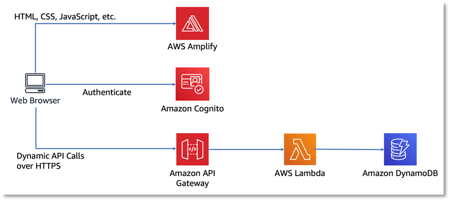
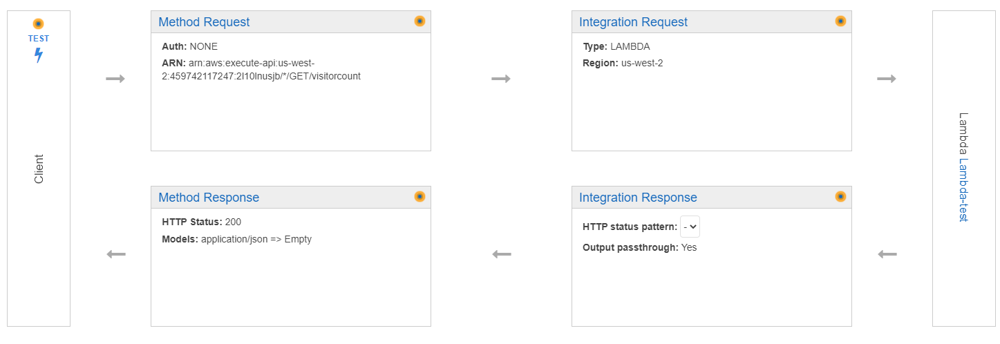

This websites uses tools from AWS to implement a visitor counter

The HTML and js files are hosted on AWS Amplify.

The js hits an Amazon API Gateway, who upon receiving a GET, invokes a lambda function.

The lambda function then interacts with DynamoDB.
DynamoDB keeps track of how many visitors there are.
The lambda function updates the DB then retrieves the information.
Then it sents it back to the API Gateway, who then returns to client.